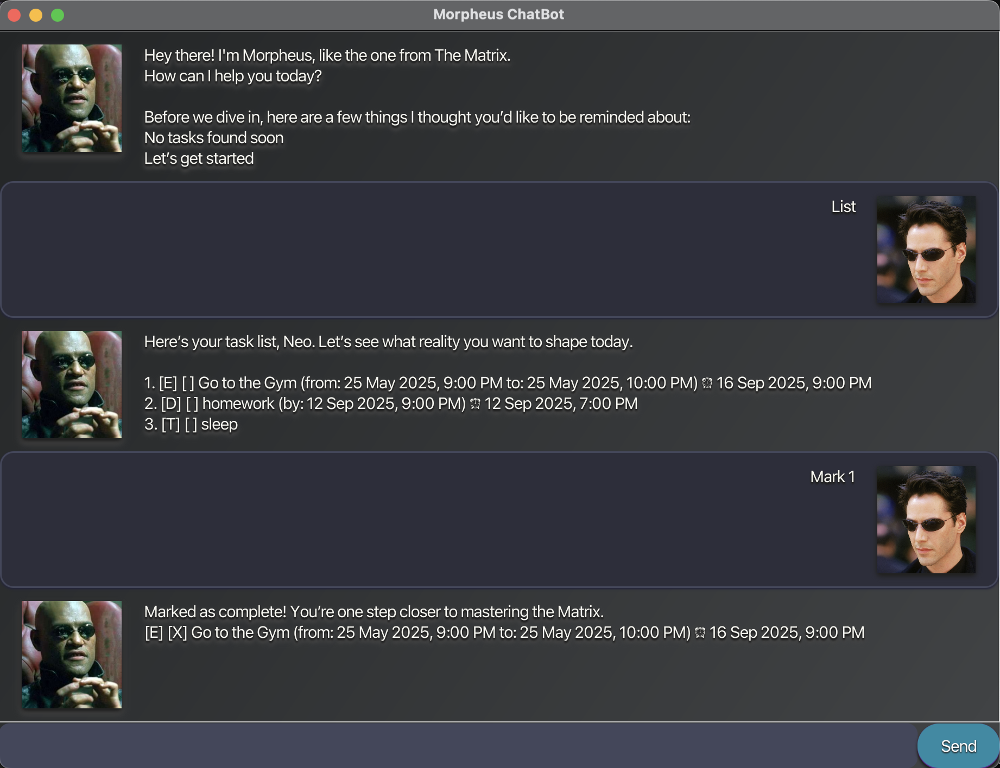

# Morpheus ChatBot User Guide

---

Morpheus ChatBot is a **desktop app for managing tasks, optimized for use via a Command Line Interface (CLI)** while still having the benefits of a Graphical User Interface (GUI). If you can type fast, Morpheus can help you manage your tasks faster than traditional GUI apps.

--------------------------------------------------------------------------------------------------------------------

## Quick start

1. Ensure you have Java `17` or above installed on your computer. 
   **Mac users:** Ensure you have the precise JDK version prescribed [here](https://se-education.org/guides/tutorials/javaInstallationMac.html).

2. Download the latest `.jar` file from the releases page.

3. Copy the file to the folder you want to use as the _home folder_ for Morpheus ChatBot.

4. Open a command terminal, `cd` into the folder you put the jar file in, and use the `java -jar morpheus.jar` command to run the application. 
   A GUI similar to the below should appear in a few seconds. Note how the app contains some sample data. 
   
   

5. Type the command in the command box and press Enter to execute it. e.g. typing **`help`** and pressing Enter will open the help window. 
   Some example commands you can try:

    * `list` : Lists all tasks.
    * `todo read book` : Adds a ToDo task called `read book`.
    * `deadline submit report /by 2025-09-18` : Adds a Deadline task.
    * `event project meeting /from 2025-09-18 /to 2025-09-19` : Adds an Event task.
    * `remind`: Adds a new Reminder to a given task.
    * `reminders` : Shows a list of tasks that are due within the next 7 days.
    * `mark 2` : Marks the 2nd task shown in the current list as done.
    * `unmark 2` : Marks the 2nd task shown in the current list as not done.
    * `delete 3` : Deletes the 3rd task shown in the current list.
    * `bye` : Exits the app.

6. Refer to the [Features](#features) below for details of each command.

--------------------------------------------------------------------------------------------------------------------

## Features

* Words in `UPPER_CASE` are the parameters to be supplied by the user. 
  e.g. in `todo DESCRIPTION`, `DESCRIPTION` is a parameter which can be used as `todo read book`.

* Items with `…` after them can be used multiple times including zero times. 
  e.g. `[tag/TAG]…` can be used as nothing (0 times), `tag/urgent`, or `tag/urgent tag/work`.

* Extraneous parameters for commands that do not take in parameters (such as `list` and `bye`) will be ignored. 
  e.g. if the command specifies `list 123`, it will be interpreted as `list`.

---

### Listing all tasks : `list`
Shows a list of all tasks currently stored in Morpheus ChatBot. 

Format: List

---

### Adding a ToDo : `todo`
Adds a ToDo task.

**Format:**  todo DESCRIPTION

**Example:**  todo read book

---

### Adding a Deadline : `deadline`
Adds a Deadline task.

**Format:** deadline DESCRIPTION /by DATE
**Example:** deadline submit report /by 18/09/2025

---

### Adding an Event : `event`
Adds an Event task.

**Format:**  event DESCRIPTION /from START_DATE /to END_DATE

**Example:**  event project meeting /from 2025-09-18 /to 2025-09-19

---

### Adding a Reminder : `remind`
Creates a new Reminder linked to a task.  
The app will alert you as the due date approaches.

**Format:** remind INDEX

---

### Viewing upcoming Reminders : `reminders`
Lists all reminders and shows tasks due soon. If you want more specific reminders, such as the reminders due today or the reminders due by tomorrow, just append the DAY SPECIFIER at the end of the reminders flag. Else, all the reminders will be shown as the default command.
The following DAY SPECIFIERS are available: 
* today
* tomorrow
* weekly

**Format:** reminders DAY SPECIFIER

**Example:** reminders tomorrow

---

### Marking a task as done : `mark`
Marks a task as completed.

**Format:** mark INDEX

---

### Unmarking a task : `unmark`
Marks a task as not done.

**Format:** unmark INDEX

---

### Deleting a task : `delete`
Deletes the specified task.

**Format:** delete INDEX

---

### Exiting the program : `bye`
Closes the Morpheus ChatBot application.

**Format:** bye

--------------------------------------------------------------------------------------------------------------------
## Command summary

Action | Format, Examples
--------|------------------
**Add ToDo** | `todo DESCRIPTION`   e.g., `todo read book`
**Add Deadline** | `deadline DESCRIPTION /by DATE`   e.g., `deadline submit report /by 2025-09-18`
**Add Event** | `event DESCRIPTION /from START_DATE /to END_DATE`   e.g., `event project meeting /from 2025-09-18 /to 2025-09-19`
**Add Reminder** | `remind INDEX`
**View Reminders** | `reminders`
**Mark** | `mark INDEX`  e.g., `mark 2`
**Unmark** | `unmark INDEX`  e.g., `unmark 2`
**Delete** | `delete INDEX`  e.g., `delete 3`
**List** | `list`
**Exit** | `bye`
